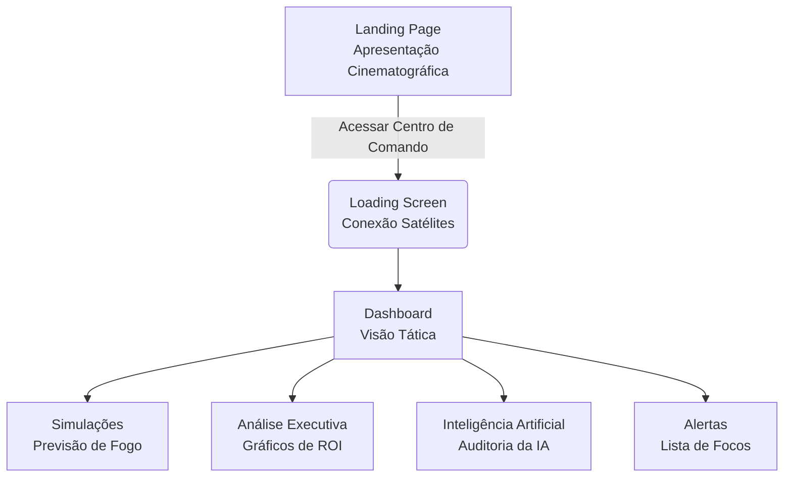

# GUIA DE APRESENTAÇÃO FIRESEEKER 🛰️🔥

Este documento foi criado para orientar qualquer membro da equipe, independentemente de sua experiência técnica, a conduzir uma apresentação impecável, profissional e de alto impacto sobre o projeto **Fireseeker**.

---

## 1. Visão Geral do Projeto

**O que é o Fireseeker?**
O Fireseeker é uma plataforma conceitual de monitoramento espacial e inteligência artificial voltada para o agronegócio e defesa civil. Ele funciona como um "centro de comando" avançado para detecção e previsão de incêndios florestais.

**Qual problema ele resolve?**
Incêndios causam prejuízos bilionários ao agronegócio e ao meio ambiente anualmente. Atualmente, a detecção é tardia. O Fireseeker propõe o uso de dados de satélite e Inteligência Artificial para detectar o fogo de forma quase instantânea e prever para onde ele irá se espalhar.

**Qual é o diferencial?**
O foco massivo em **Interface (UI) e Experiência do Usuário (UX)**. O sistema adota o padrão visual de empresas como SpaceX, Palantir e NASA. Em vez de painéis confusos cheios de planilhas, a informação crítica é mostrada num mapa de satélite 3D dinâmico, facilitando decisões em frações de segundo.

**O objetivo do protótipo:**
Este protótipo foca exclusivamente em provar o conceito visual e de interação. O objetivo é causar um impacto emocional nos usuários, professores e investidores, mostrando "como o produto final se parecerá e como ele funcionará".

---

## 2. Tecnologias Utilizadas

Para garantir fluidez, escalabilidade e a aparência cinematográfica, o protótipo foi construído utilizando as melhores ferramentas do mercado atual:

| Tecnologia | Função no Projeto | Explicação Simples |
| :--- | :--- | :--- |
| **React** | Interface | O esqueleto do projeto. Permite criar a interface dividindo a tela em peças (componentes) reutilizáveis. |
| **TypeScript** | Tipagem | É uma camada de segurança sobre o código que impede erros básicos antes mesmo de o projeto rodar. |
| **Tailwind CSS** | Estilização | Ferramenta de design que permite "pintar" e formatar a tela de forma rápida, criando o aspecto dark/neon. |
| **Framer Motion** | Animações | O motor gráfico por trás dos movimentos, pop-ups, brilhos e efeitos de transição cinematográficos. |
| **MapLibre GL** | Mapas 3D | Responsável por renderizar o mapa de satélite realista e os terrenos por onde as simulações ocorrem. |
| **Recharts** | Gráficos | Biblioteca matemática usada para desenhar os gráficos de desempenho e prejuízo financeiro. |
| **Cobe** | Globo 3D | O motor WebGL que renderiza o globo terrestre interativo com satélites e focos ao redor do mundo. |

---

## 3. Estrutura de Pastas

O código foi dividido de forma modular e escalável:

```text
src/
├── assets/           # Imagens, vídeos e fontes do projeto
├── components/       # Componentes visuais reutilizáveis (botões, radar, globo)
│   ├── FireMarker.tsx      # Marcador de foco de incêndio avançado (brilha e pulsa)
│   ├── Globe.tsx           # Renderizador do Globo WebGL da Landing Page
│   ├── HeroBackground.tsx  # O fundo espacial ultra-hd da página inicial
│   ├── LoadingScreen.tsx   # A tela inicial que imita "carregamento de satélites"
│   ├── RiskRadar.tsx       # O radar rotativo no centro de comando
│   └── Sidebar.tsx         # Menu de navegação lateral esquerdo
├── pages/            # As telas inteiras e principais do sistema
│   ├── AIIntelligence.tsx  # Tela com os neurônios da IA e métricas de precisão
│   ├── AlertsScreen.tsx    # Feed de alertas em tempo real ("urgências")
│   ├── Dashboard.tsx       # O mapa do Centro de Comando principal
│   ├── ExecutiveAnalytics.tsx # Telas com gráficos financeiros e ROI
│   ├── LandingPage.tsx     # A porta de entrada do projeto (Hero Section)
│   └── SimulationScreen.tsx# Simulador de vento e propagação de fogo 
├── App.css           # Estilos globais adicionais (fontes, utilitários)
├── App.tsx           # O roteador principal que diz qual tela carregar
├── index.css         # As definições de design system (variáveis de cor neon, etc)
└── main.tsx          # O ponto de ignição do sistema inteiro
```

---

## 4. Explicação dos Arquivos Principais

* **`main.tsx` e `App.tsx`**: O coração do projeto. O `main` injeta o código no navegador. O `App` cria o "mapa de navegação", definindo qual link leva para qual página (ex: `/dashboard` carrega o Centro de Comando).
* **`LandingPage.tsx`**: A primeira coisa que o usuário vê. Foi arquitetada para ter impacto de cinema (SpaceX/Palantir). Utiliza o `HeroBackground` para renderizar a Terra em Ultra-HD, simulando uma sala espacial.
* **`Dashboard.tsx`**: O Centro de Comando. O arquivo mais complexo da interface. Carrega mapas da ESRI (Satélite), integra os radares e posiciona os focos ativos sobre a região do Mato Grosso.
* **`SimulationScreen.tsx`**: A tela mais interativa. Aqui, matemática pesada (senos e cossenos combinados com ruído) é usada para simular fisicamente a progressão e morfologia caótica do fogo empurrado pelo vento sobre um polígono no mapa.
* **`ExecutiveAnalytics.tsx`**: A visão de negócios. Arquivo focado na renderização de gráficos financeiros usando Recharts para provar a investidores o ROI (Retorno sobre Investimento) da solução.
* **`AlertsScreen.tsx` e `AIIntelligence.tsx`**: Telas de apoio. Validam o conceito de que existe uma Inteligência Artificial agindo por trás e organizam os dados brutos num feed fácil de ler.

---

## 5. Fluxo de Navegação

A jornada do usuário foi desenhada para convencer primeiro e operar depois:



---

## 6. Componentes Visuais Importantes

* **Hero Background (Landing Page)**: Imagem ultra-HD espacial com camadas sobrepostas de estrelas e poeira. Gera a sensação "Orbital".
* **FireMarker (Marcador de Fogo)**: Um componente 3D complexo que pisca, cria anéis de "ping", tem luz neon ("glow") de severidade, e desenha uma linha holográfica. Fundamental para a imersão.
* **Mapa ESRI Satélite com Dark Overlay**: Em vez de mapas comuns estilo Google Maps, usamos a textura bruta de satélite aplicada com filtros escuros de contraste altíssimo, simulando radares militares.
* **Polígono Orgânico de Fogo**: Na simulação, a forma da área queimada não cresce geometricamente, ela se estica e se distorce baseada em ondas matematicas criando pontas orgânicas que simulam a combustão real na natureza.

---

## 7. Animações e Experiência Visual

O grande trunfo do **Fireseeker** é a fluidez. 
* O **Framer Motion** foi aplicado em 100% da interface. Cada menu não apenas "aparece", ele desliza e se ilumina.
* O **Design System** é Dark Glassmorphism. As caixas não têm fundo sólido, são de vidro translúcido com bordas iluminadas neon (Ciano e Esmeralda).
* Tudo responde ao **Efeito Parallax**: se o usuário mexer o mouse na Landing Page, as estrelas, satélites, a Terra e a interface se movem em velocidades diferentes, garantindo a escala 3D e provando que o app não é uma imagem estática barata.

**Inspirado em**: Palantir Gotham (Software Militar), Interfaces de lançamento da SpaceX, e os óculos Apple Vision Pro.

---

## 8. IMPORTANTE PARA A APRESENTAÇÃO: Dados Simulados

> [!WARNING]
> **LEIA COM ATENÇÃO:** Você deve comunicar ativamente que este projeto é um Protótipo de Alta Fidelidade Frontend (Mockup).
>
> 1. **Não temos satélites no espaço**. A comunicação "Conectando INPE/NASA" na tela de carregamento é uma emulação visual da arquitetura proposta.
> 2. O fogo espalhando na simulação é uma animação matemática, **não** um motor meteorológico físico real atrelado a relevo ou clima em tempo real.
> 3. Os dados financeiros e as coordenadas de chamas são "mockados" (fictícios) para ilustrar o potencial do sistema.
>
> **Por que isso é bom?** Ao apresentar, explique que: *"Decidimos investir 100% do tempo de desenvolvimento em validar a usabilidade e a arquitetura visual da interface antes de gastar milhares de reais processando inteligência artificial pesada."*

---

## 9. Roteiro de Apresentação (Pitch de 5 Minutos)

Siga este roteiro rigorosamente ao passar as telas:

* **Slide 1 - O Problema (0:00 - 0:45)**: "Bom dia! Incêndios destroem patrimônios e vidas. Hoje, você descobre que sua fazenda pegou fogo horas depois que começou. A detecção é visual ou dependente de clima. É tarde demais."
* **Slide 2 - A Solução (0:45 - 1:15)**: *(Abra a Landing Page e mexa o mouse suavemente para mostrar o Parallax)* "Este é o Fireseeker. Uma plataforma que transforma dados puros de satélites do INPE e NASA em alertas em tempo real. Monitoramos tudo de forma orbital."
* **Slide 3 - O Coração do Sistema (1:15 - 2:30)**: *(Clique em 'Acessar Centro de Comando')* "Aqui estamos na nossa plataforma de ação. Observe os detalhes holográficos e o radar em tempo real. Não existem botões inúteis. Quando um sensor infravermelho detecta uma anomalia, nossa Inteligência Artificial calcula se é apenas um reflexo, maquinário ou um princípio real de incêndio (Aponte para o FireMarker no mapa)."
* **Slide 4 - Prevenção Preditiva (2:30 - 3:30)**: *(Vá para Simulações)* "Mas a magia está aqui. Saber que começou não basta. Clicando em 'Rodar Cenário', nossa matemática simula o vento empurrando a linha do fogo de forma orgânica. Conseguimos prever onde o fogo estará daqui a 3 horas, permitindo que as brigadas o interceptem antes."
* **Slide 5 - Análise Executiva (3:30 - 4:15)**: *(Vá para Análise Executiva)* "Tudo isso se traduz em economia. Aqui os gestores e investidores conseguem visualizar o quanto de área foi salva pela interceptação antecipada do fogo versus as perdas financeiras."
* **Slide 6 - Conclusão (4:15 - 5:00)**: "O Fireseeker não é apenas mais um software. É uma plataforma classe-militar para o agronegócio do século 21. Construímos uma fundação técnica robusta (React e WebGL) capaz de suportar as APIs reais do futuro. Obrigado!"

---

## 10. Perguntas Possíveis da Banca (Q&A)

As bancas avaliadoras farão perguntas para testar seu domínio do projeto. Esteja preparado:

**1. O sistema já está integrado ao INPE ou à NASA de verdade?**
*Resposta:* "Não nesta etapa. A arquitetura atual foca em validar o fluxo de usuário (UX) e o desempenho visual do Frontend utilizando React. Integrar um backend real seria o próximo passo da roadmap."

**2. Como a Inteligência Artificial funciona no projeto atual?**
*Resposta:* "Hoje ela é simulada (Mock). O conceito proposto é que a IA treinada em Redes Neurais analisaria os pixels de infravermelho da imagem de satélite, distinguindo trator/reflexo de calor de fogo real, para evitar alarmes falsos."

**3. Por que usar tecnologias de mapa 3D (MapLibre) ao invés de um Google Maps normal?**
*Resposta:* "Google Maps possui licenças restritivas para dashboards táticos e estilo engessado. Usar MapLibre GL e Carto nos permite total liberdade para escurecer as imagens de satélite, injetar polígonos orgânicos e manter renderização em hardware (WebGL) a 60 frames por segundo."

**4. A simulação de vento que vocês mostraram é precisa?**
*Resposta:* "É um protótipo físico aproximado. Desenvolvemos algoritmos baseados em trigonometria e ruído (senos e cossenos) que modelam uma expansão muito mais orgânica e assustadora que um mero círculo crescendo. Em produção, ele engoliria os dados de topografia do terreno."

**5. Qual a finalidade da Landing Page cinematográfica se isso é uma ferramenta técnica?**
*Resposta:* "Ferramentas B2B de alto valor (como o software Palantir) não vendem apenas dados, vendem 'confiança e segurança militar'. A Landing Page serve para imediatamente comunicar autoridade e captar investidores, mostrando capacidade técnica de ponta da equipe."

**6. Como vocês garantiriam a performance do sistema rodando todas essas animações?**
*Resposta:* "Utilizamos Framer Motion e renderização no Canvas. Esses métodos utilizam a Placa de Vídeo (GPU) e não o Processador (CPU) para calcular a animação. Somado ao React/Vite, garantimos que nada trave, mesmo se o mapa estiver cheio de alertas."

**(Outras 14 Perguntas Básicas)**

**7. Quais foram as maiores dificuldades técnicas do projeto?**
*Resposta:* "A otimização de performance no React. Garantir que as simulações e cálculos complexos de trigonometria ocorressem no navegador sem travar a thread principal exigiu o uso cuidadoso de Hooks e animações via placa de vídeo."

**8. Por que escolheram React em vez de Vue ou Angular?**
*Resposta:* "O ecosistema do React é massivo, garantindo excelente suporte a bibliotecas de mapas como MapLibre e visualização de dados como Recharts, essenciais para nossa interface complexa."

**9. E os dados? Como vocês planejariam o banco de dados?**
*Resposta:* "Um banco relacional como PostgreSQL para gerenciar clientes e propriedades, combinado com extensões como PostGIS para lidar com buscas geolocalizadas massivas."

**10. Qual seria o custo operacional dessa solução real?**
*Resposta:* "A extração de imagens de infravermelho de satélites como GOES ou Sentinel é frequentemente pública. O custo estaria atrelado ao processamento em nuvem das imagens na nossa IA (AWS GPU instances) e no armazenamento de longo prazo."

**11. Como isso concorre com painéis que o próprio governo oferece?**
*Resposta:* "Painéis governamentais como do INPE fornecem dados brutos e são reativos. Nossa plataforma é Preditiva, antecipando o espalhamento, focada em alertar ativamente o fazendeiro antes que o fogo chegue à lavoura."

**12. O que acontece se a conexão de internet da fazenda cair?**
*Resposta:* "O sistema foi desenhado como um Cloud-Command-Center. Ele enviaria alertas via SMS, ligações automatizadas ou conexão via satélite (Starlink), sem depender do produtor estar online ativamente."

**13. Há planos para um aplicativo mobile?**
*Resposta:* "A arquitetura inicial foi projetada para desktop/tablet, já que é voltada para um Centro de Controle. Em versões futuras, alertas simplificados poderiam ser integrados em um app móvel, usando React Native, compartilhando a base do nosso código atual."

**14. Como a inteligência artificial calcularia o vento e a vegetação na simulação?**
*Resposta:* "O modelo importaria relevos topográficos e dados de vento de APIs meteorológicas. Fogo sobe mais rápido em morros e queima rápido em gramíneas secas. Nossa IA simularia fluidos termodinâmicos usando essas variáveis."

**15. Qual a margem de erro do sistema (Falsos Positivos)?**
*Resposta:* "Ao utilizar visões multiespectrais (térmico + óptico), a meta é reduzir Falsos Positivos causados por chaminés industriais ou colheitadeiras quentes a menos de 1%. A IA faria esse descarte automático."

**16. Por que o design todo escuro (Dark Mode)?**
*Resposta:* "Diminui drasticamente o cansaço visual em operadores que observam telas por longos turnos, e permite que as cores semânticas (Vermelho = Crítico, Verde = OK) garantam atenção instintiva do cérebro."

**17. O que falta para isso ser comercializado amanhã?**
*Resposta:* "Nós construímos o motor do carro, mas falta o tanque de gasolina (Backend Python) e a chave (Autenticação JWT). O Frontend de venda já está perfeitamente demonstrável."

**18. Vocês pensaram em LGPD?**
*Resposta:* "Sim. Nossa plataforma lida com polígonos de terrenos. Informações de propriedades seriam criptografadas, e imagens de satélite são públicas e não configuram invasão de privacidade no nível de resolução que operamos."

**19. É possível integrar com drones da própria fazenda?**
*Resposta:* "Sim. Nossa API poderia receber feeds RTMP de drones para confirmar visualmente se um alerta de IA é de fato uma chama alta, criando a camada de 'confirmação humana' antes de despachar bombeiros."

**20. O que vocês aprenderam com esse projeto?**
*Resposta:* "Que a percepção de valor de um software não vem apenas de códigos complexos no backend, mas sim da forma como entregamos a informação para o cérebro humano entender decisões de risco em frações de segundos. A Interface não é estética, é funcional."

---

## 11. Resumo Executivo para o Professor

**Projeto**: Fireseeker
**Tema**: Monitoramento Espacial de Focos de Incêndio com IA.

**O que foi desenvolvido e Prototipado?**
O grupo optou por focar no desenvolvimento profundo do **Client-Side (Frontend)** de alta complexidade. Em vez de entregar um sistema FullStack genérico que não fizesse nada direito, entregamos um Produto Mínimo Viável focado na camada de apresentação (UX/UI Premium) em React e TypeScript.

**Conceitos de Engenharia de Software Aplicados:**
* **Separação de Contextos (Arquitetura de Pastas):** Views isoladas de Componentes e Estilos globais.
* **Tipagem Estática:** Uso avançado de TypeScript para prevenir erros de compilação em interfaces dinâmicas complexas.
* **State Management Local:** Uso profundo do ciclo de vida do React (`useState`, `useEffect`, `useRef`) para gerenciar simulações baseadas em tempo.
* **Componentização e Reutilização:** Modularização de componentes críticos (ex: Marcadores de Satélite) para manter o código limpo e sustentável.

**Potencial da Solução:**
O protótipo serve como alicerce estrutural impecável. Todo o frontend está preparado. Para transformar este protótipo na versão final de mercado, basta a substituição da camada de "dados simulados" pela camada de requisições API reais (Axios/Fetch) puxando os dados de um backend Python estruturado. O projeto prova que a equipe detém habilidades visuais, lógicas e criativas de altíssimo nível.
